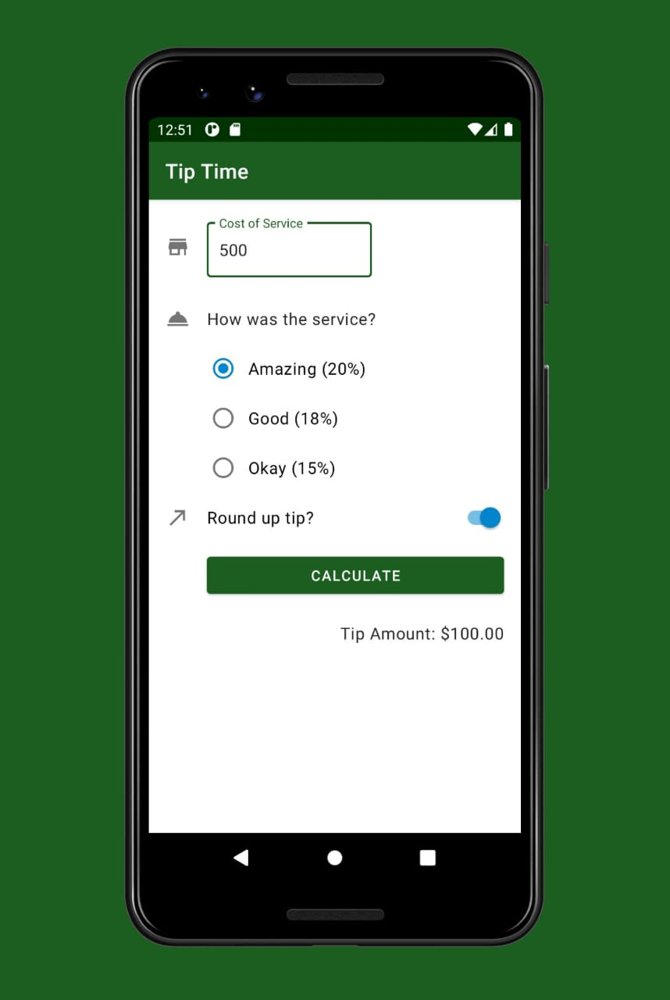

# Tip-Time
Tip TIme is a basic tip calculator application in kotlin. Users can enter the amount of the bill and percentage of amount that they wish to pay as tip. The app also has a toggle to either round off the tip to nearest integer or not. It splits the bill fast, great for dining and drinks with friends!

## Screenshots

